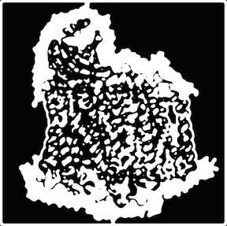

# Introduction

This is part 1. Referenced by [@Fadda:2008p5482].
    
    This is a blockquote

This is the next paragraph. This is the next paragraph. This is the next paragraph. This is the next paragraph. This is the next paragraph. This is the next paragraph. This is the next paragraph. This is the next paragraph. This is the next paragraph. This is the next paragraph. This is the next paragraph. This is the next paragraph. This is the next paragraph. This is the next paragraph. This is the next paragraph. This is the next paragraph. This is the next paragraph. This is the next paragraph. This is the next paragraph. This is the next paragraph. This is the next paragraph. This is the next paragraph. This is the next paragraph. This is the next paragraph. This is the next paragraph.[^1]

[^1]: This is a footnote with an inline citation @Fadda:2008p5482]

_this text is italics_ and **this text is bold**.

## Subsection 1

Here is an inline equation of $1+1 = 2$.

* Here
* Is a
* List
    * Sublist!

### Sub-subsection 1

Here is an equation.

\begin{equation}
O_2 + 4e^{-}_{p} + 8H^{+}_{n} \rightarrow 2H_{2}O + 4H^{+}_{p}
\end{equation}

\clearpage

## This is a figure

See the figure below:

